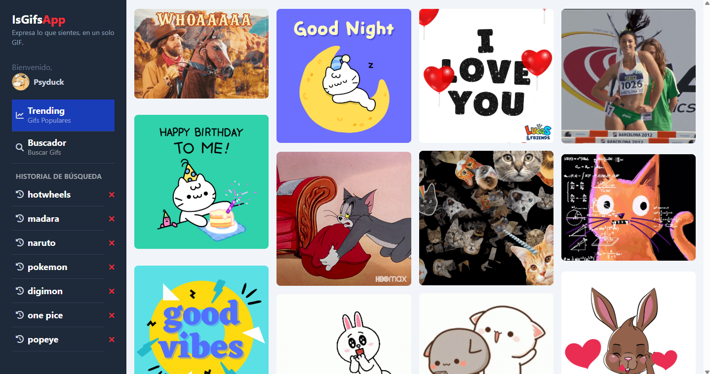

# IsGifsApp
IsGifs‑App es una aplicación web que permite buscar y visualizar GIFs utilizando la API de GIPHY. Esta aplicación fue desarrollada siguiendo el curso de Fernando Herrera y ha sido mejorada a lo largo del proceso.

### DEMO: 



### Tecnologías:
- Angular 19
- Tailwind CSS v4.01
- API de [GIPHY](https://developers.giphy.com) (para búsqueda y visualización de GIFs)

### Dependencias implementadas:
* Tailwind cSS
```
npm install tailwindcss @tailwindcss/postcss postcss --force
```

### Contribuciones:
Si estas interesado en contribuir sigue estos pasos:
1. Haz un fork del proyecto.
2. Crea una nueva rama para tu mejora/fix:
```
git checkout -b feature/nombre-de-la-funcion
```
3. Realiza cambios y haz commits con mensajes claros (usa Conventional Commits).
4. Envía tu rama y abre un Pull Request describiendo tus cambios.

### Nota:
- Instala dependencias para correr el proyecto:
```
npm install
```
